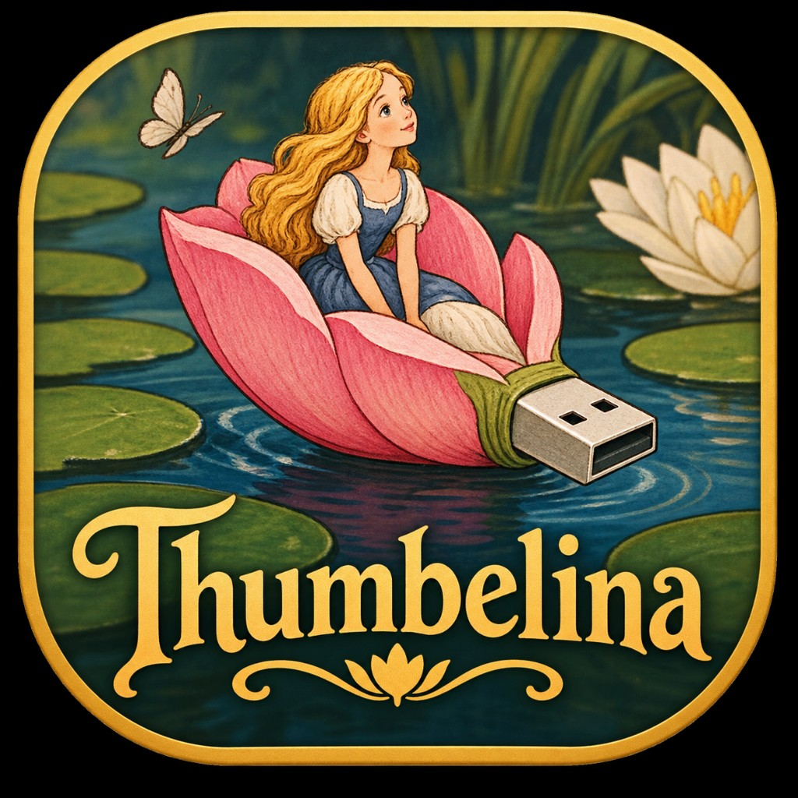
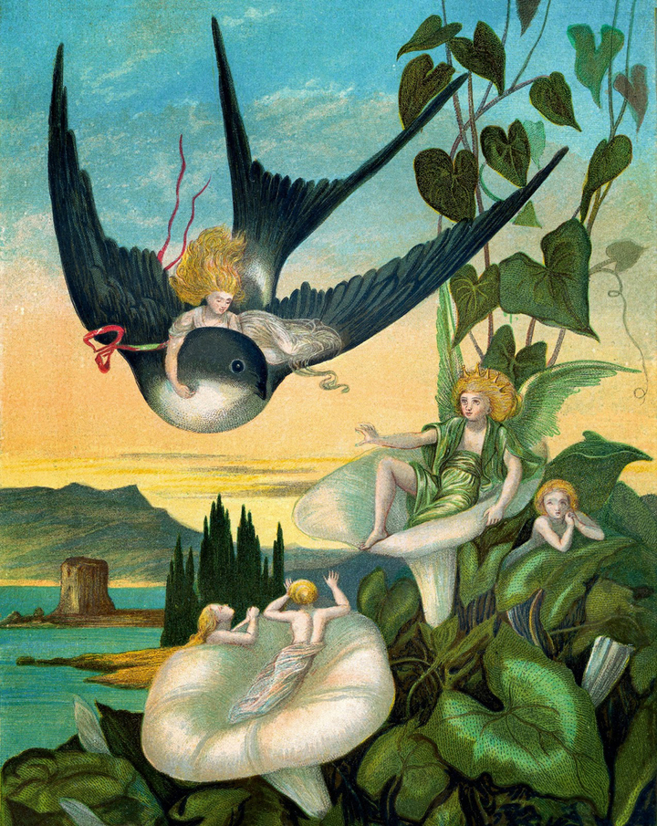
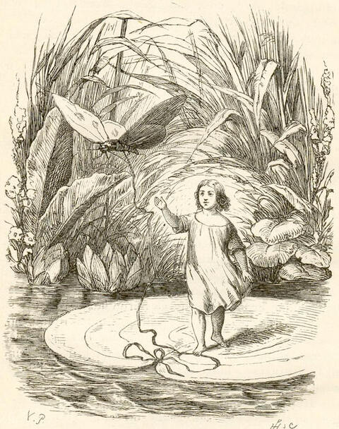
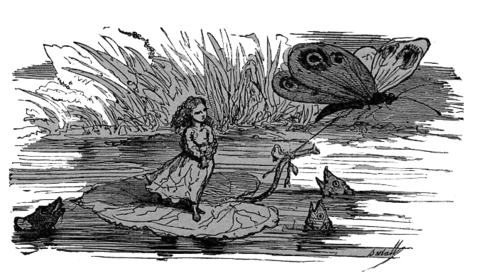

<div align="center">

<a href="https://github.com/Desktop-Tooling/Thumbelina/graphs/contributors"></a>
<a href="https://github.com/Desktop-Tooling/Thumbelina/network/members"></a>
<a href="https://github.com/Desktop-Tooling/Thumbelina/stargazers"></a>
<a href="https://github.com/Desktop-Tooling/Thumbelina/issues"></a>
<a href="https://github.com/Desktop-Tooling/Thumbelina/blob/main/LICENSE"></a>

<br />


<h3 align="center">Thumbelina</h3>

<p align="center">
  Multiboot USB orchestrator — live ISOs, thin Btrfs installs, or both.<br />
  Small stick, chosen purpose: not whatever the installer assumed.
  <br />
  <a href="https://desktop-tooling.github.io/docs/thumbelina/"><strong>Explore the docs »</strong></a>
  &middot;
  <a href="https://desktop-tooling.github.io/demos/thumbelina/">Demos</a>
  <br />
  <br />
  <a href="https://github.com/Desktop-Tooling/Thumbelina/issues">Report Bug</a>
  &middot;
  <a href="https://github.com/Desktop-Tooling/Thumbelina/issues">Request Feature</a>
</p>

</div>

## About

Thumbelina formats and manages USB sticks so **size stops defining the job**. Pick a live-ISO toolkit, a thin Btrfs install pool, or both — and keep a Windows-visible branded volume so the drive is never a mystery.

Named for Andersen’s Thumbelina: resisting everyone who tries to decide what a small thing is *for*.

| Mode | What you get |
| --- | --- |
| **Live ISOs** | ESP + large exFAT — drag `.iso` files into `isos/` |
| **Installed OSes** | ESP + small service exFAT + Btrfs pool (thin subvolumes, zstd, snapshots) |
| **Both** | Sized exFAT for ISOs + remaining Btrfs for installs |

### Built With

* **Runtime:** D (LDC/DMD), DUB
* **UI:** dlangui
* **Disk model:** GPT · FAT32 ESP · exFAT service/ISO · Btrfs install pool
* **Docs:** AsciiDoc / Antora (Desktop-Tooling docs hub)

## Getting Started

### Prerequisites

* [DUB](https://dub.pm/) + LDC or DMD
* Linux for full Btrfs format/install; Windows can format **live-iso** natively and emit a Linux helper script for the rest

### Build

```bash
dub build --config=application   # CLI → bin/thumbelina
dub build --config=tina          # short alias → bin/tina
dub build --config=gui           # GUI → bin/thumbelina-gui
dub build --config=unittest
```

### CLI examples

```bash
thumbelina modes
thumbelina plan --mode installed --size-gib 64
thumbelina helper-script --mode both --disk 2 --out ./helper
```

## Brand & art

<p align="center">
  
</p>

Product face: painted PNG under [`assets/brand/`](assets/brand/) (sizes in [`assets/icons/`](assets/icons/)).

SVG marks (horizontal rose/gold USB drive silhouette):

| File | Use |
| --- | --- |
| [`thumbelina-glyph.svg`](assets/icons/thumbelina-glyph.svg) | Isolated drive (no tile) |
| [`thumbelina-mark.svg`](assets/icons/thumbelina-mark.svg) | Drive on app tile |
| [`thumbelina-glyph-mono.svg`](assets/icons/thumbelina-glyph-mono.svg) | Mono / `currentColor` |

### Public-domain companions (README decoration)

Historical Andersen illustrations (US public domain). Attribution: [`assets/public-domain/ATTRIBUTION.txt`](assets/public-domain/ATTRIBUTION.txt).

<p align="center">
  
  &nbsp;
  
  &nbsp;
  
</p>

## Changelog

See [CHANGELOG.md](CHANGELOG.md) and [changelog/](changelog/).

## License

Distributed under the MIT License. See [LICENSE](LICENSE).

## Contact

* Org: [Desktop-Tooling](https://github.com/Desktop-Tooling)
* Issues: [Thumbelina issues](https://github.com/Desktop-Tooling/Thumbelina/issues)
